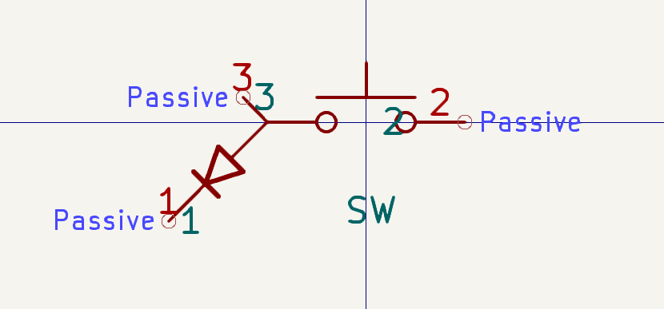
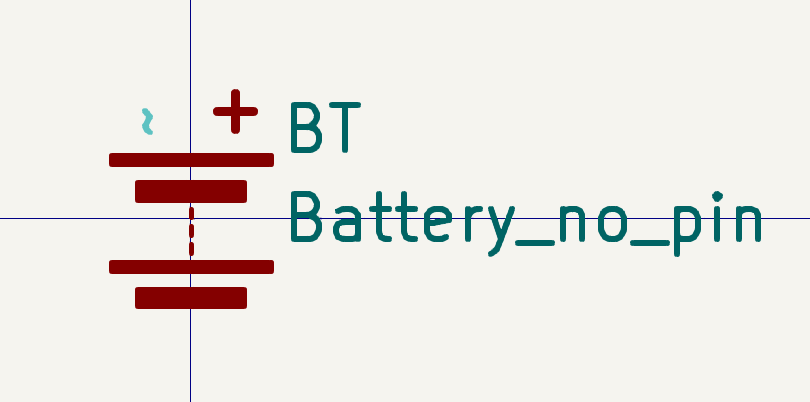
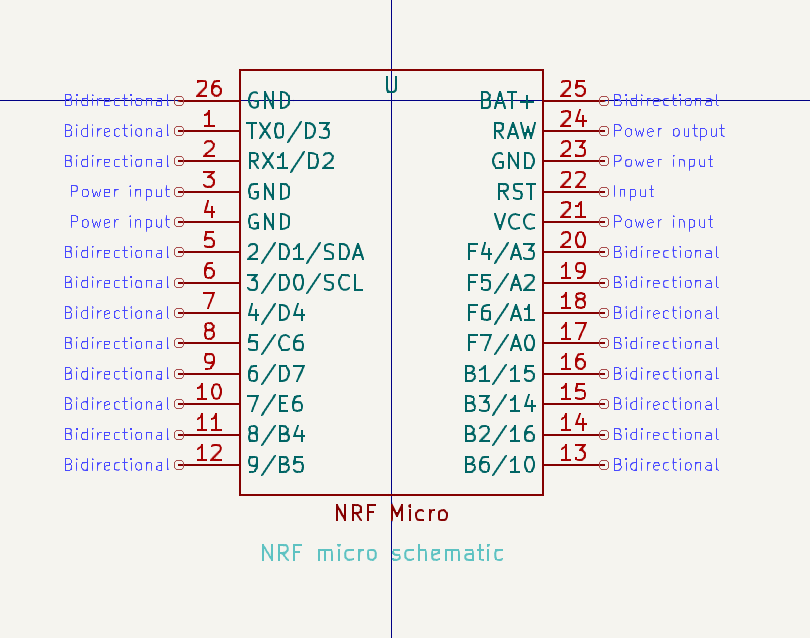
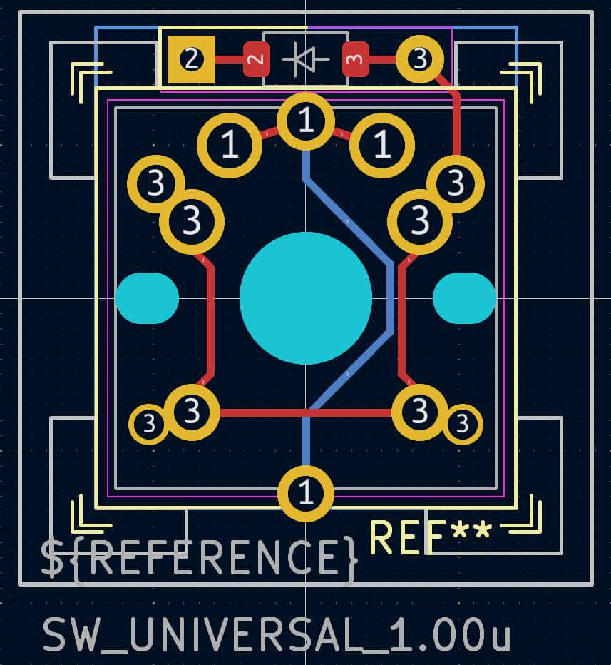
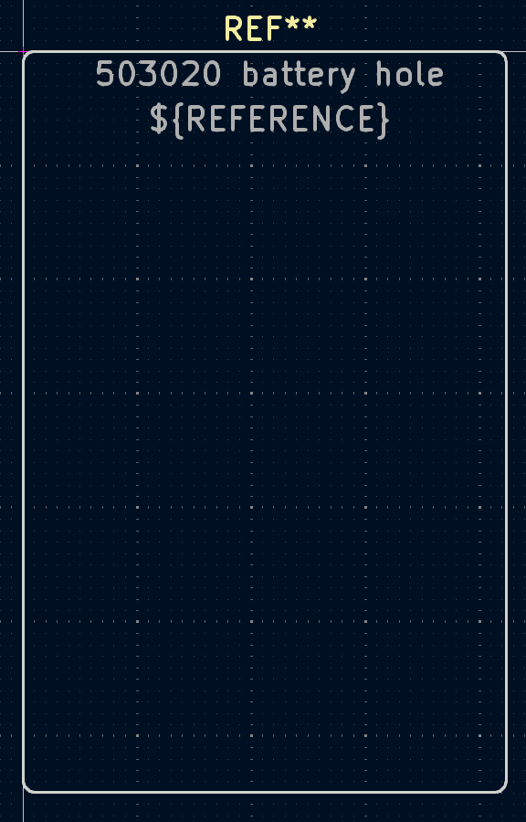
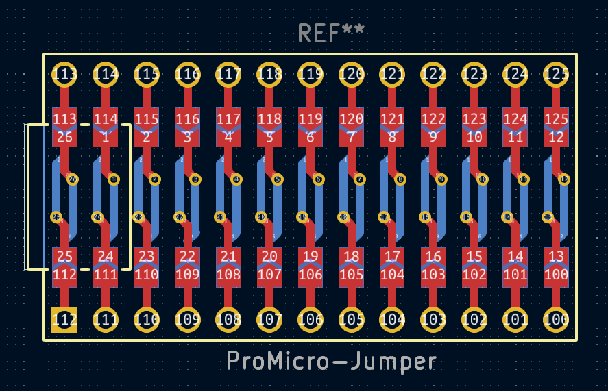
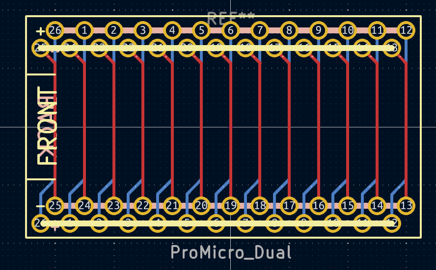

# keyboard-kicad-lib

Please if you find this repository usefull don't hesitate to **share it**, **star it**, **check my blog**.

This is the official repository for the **easy keyboard kicad library**.
This library has been made in order to lower the skill ceiling for keyboard development.

The library has been used to create the [Tokei keyboard](https://github.com/Eymeric65/tokei-keyboard) and the [Hillside speedrun](https://github.com/Eymeric65/hillside-speedrun). Feel free to send me a mail or a DM in order that I add your creation to the list !! 

## How to use the library

I made a four part video series on how to use the library and make a keyboard with it : 

- [Youtube playlist](https://www.youtube.com/watch?v=DKHVKUeyZYA&list=PLMlwgCdN55A79BfmBBxwvMiams9BRwqqF)

- [How to make a keyboard: PART 1 - Schematic](https://youtu.be/DKHVKUeyZYA)
- [How to make a keyboard: PART 2 - Layout](https://youtu.be/WUHc1DzQBDs)
- [How to make a keyboard: PART 3 - Making the 3D case](https://youtu.be/3jeq95zWQLk)
- [How to make a keyboard: PART 4 - Assembly](https://youtu.be/-548s88u8K4)

So this is a *normal* kicad library. For the main part you can make the keyboard using this library totally normally.
The best part is when creating the 3D shell of the keyboard, every footprint has special feature in order to streamline the creation of the 3d printed part. Here is a little summary : 
- **Edge.cuts :** The board edge cut, used like in any other electronic project, However got also the cut for the battery
- **User.Drawings :** User drawing show the Keycap U-rectangle, it is used in order to make the *Edge.custs* of the board
- **User.1 :** The first User layer, is used for *key supporter* in the **top cover plate**.
- **User.2 :** The second User layer, is used for *bottom cover space holder* in the **bottom cover plate**. (it is the bottom space for component...)
- **User.3 :** The third User layer, is used for *key and mount hole* in the **top cover plate**.
- **User.4 :** The fourth User layer, is used for *mount and utilitary hole* in the **bottom cover plate**

In addition, every footprint is totally reversible, so after making the 3D part you can simply mirror the keyboard in order to get the other half.

## Library component detail

In this section I will detail every componenet of the library. 

### Schematic

| title | schematic image | comment |
|:-----:|:---------------:|:-------:|
|Keyboard push | | the base schematic for the push button and the diode |
| Battery no pin | | schematic for the battery without any pin (for hole purpose) |
| NRF micro jumper |  | NRF micro schematic for the reversible footprint | 
| NRF micro *legacy* |  | For legacy purpose, compatible with old footprint | 

### Footprint

| title | footprint image | comment |
|:-----:|:---------------:|:-------:|
|Keyboard switch |  |  | The base footprint for the keyboard switch, it is reversible and compatible with multiple brand : Cherry MX, reddragon low profile, Kailh low profile. Contain the diode |
|Battery no pin |  | The battery footprint without any pin, it is used for the battery holder |
|NRF micro jumper |  | The NRF micro footprint with jumper, it is reversible and compatible with the NRF52840 module, include jumper to root the signal reversibly |
|NRF micro *legacy* |  | The NRF micro footprint for legacy purpose, it is compatible with the NRF52840 module, but not reversible |

## Keyboard speedrunning

For more information about Keyboard speedrunning please check here

## Keyboard made thanks to this repository

don't hesitate to reach me in order that I cite you back here ! *(you can also ask for a merge request)*

- [Tokei keyboard](https://github.com/Eymeric65/tokei-keyboard) : The tokei keyboard is a split 40% keyboard with a 3D printed case, it is made using this library.
  
- [Hillside speedrun](https://github.com/Eymeric65/hillside-speedrun) : A remake of the hillside keyboard.
  

## Contribution

The main contributor is Eymeric CHAUCHAT.
*blog :* [chauquest.com](chauquest.com)
*youtube :* [Eymeric65](https://www.youtube.com/@eymericchauchat)

## Donation

If you want to support my work, you can buy me a coffee on [Ko-fi](https://ko-fi.com/eymericchauchat). I am a student that provide all of this work for free, so any donation is welcome and will help me to continue my work.